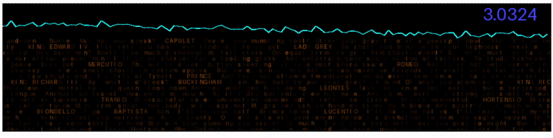

# nano-research-gpt
an experimental testbed for novel approaches to machine learning in transformer architectures.
Please propose changes by either email or by opening a new issue.

the current forward thinking work is the tapetransformer.
this model has been revised a bunch and tried some different tricks.
in the process of making it more understandable, i have added a very nice attention visualizing mechanism.

the models current structure is a work in progress, but this seems good.
what we have is a multi-reasoning model that considers both sequential and positional information.
the coda "encodes" a representation that is then used by all of the residualheads- or critics.
the critics then learn individual patterns that could be present, gesticulating and lecturing.
we force them to use a common language(their tokenwise embedding).
the final moderator is intended to curate the output by utility of the refined internal representation.
that is to say, the refinedheads learn to produce a diversity of opinions, and the moderator learns
what opinions can or wont contradict. this last merging part is a work in progress.

the critics all receive a mixture of information from the coda and the prophet, and
the moderator curates from the coda and the critics.
this is hopefully capable of by design of structure capable of partitioning reason to the following steps:
What IS-> what Could Be -> What Can Be
The Char-RNN allows us to have a learned representation of sequential-relational information, and needs to be added to the KV system 
for sequential generation. that is the next "TODO" on our list. This also eliminates(hopefully) the need and limitation
of reasoning tokens and latent state, although chain of reasoning is still possible.

the curator or coda borrows from https://arxiv.org/pdf/2502.05171
although i have misused the term coda and used to label my prelude P.
we approach this problem epistemologically, cybernetically, perhaps from the following conjectures:
reasoning is merely memory + permutation
memory is merely relational data
reasoning is, in fact, permutation of relational data by use of myriad mechanisms

the idea of memory is poor for reasoning purposes, because it does not really allow learning patterns, unless it allows for space to set them aside while considering other patterns,
and for recursion to allow generating new tokens while paying attention to patterns "in construction".

the problem, of course, is no matter what you do, you're *still* in a recursive situation where you need to produce products and then attend to them. In other words, its useless during training because of how transformers learn- they learn by predicting probability of sequences, not sequences of probability, unless you allow the model to attend to its own products DURING training, which entails some rather complicated setups..

so we ask what is the transformer really putting out?
it is putting out a sequence of probabilities for each position.
it is not putting out or indeed can even model the inverse- a probability of sequence.
but, it can use such a piece of information like a blue print to refine its behavior, cant it?
after all, doesnt the char-rnn deliver exceptional textual output, albiet output which is only structured well?
so what if we discipline our model with structural information?

#currently model uses just Estimated Total Size (MB): 161.74
#during inference in mixed precision 
#and training is 1934.71
#and an int8 quantized would be under 50mb
#there are 49,879,553 trainable params and no untrainables
#probably anyone could train this on a 3050 or better with at least 8gb of ram
#it uses 6 for reasons im not sure of, probably cuda crap
#cause its so tiny it will probably be able to be quantized and run really fast

Please note I dont know anything about machine learning, this is all an experiment, take of it what you wish
if you're looking for the easy value signal to tell you what to steal or copy, there is none
my work is garbage until proven otherwise- everything is a concept
https://github.com/falseywinchnet/nano-research-gpt/blob/main/TapeTransformer.ipynb

the tailedness of distribution to use is still a matter of examination and research
not that i am not a mathematician, not institutionally affiliated
if i have done anything deserving publishing, you can help
if i need to refine anything you personally have deeper insight on than o1 or sonnet
please, by all means, suggest
